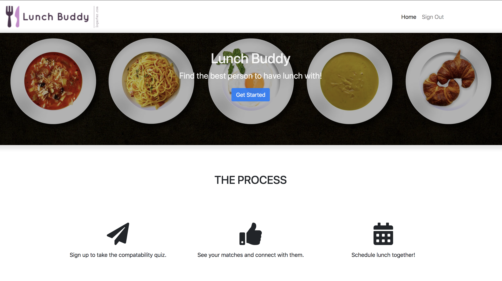

## Lunch Buddy 

[Try it out! ](https://dashboard.heroku.com/apps/lunchbuddie/logs)

## What is this? 

This app is here to help you find people to have lunch with and connect. The plan is to have integration with letsdolunch in the future. In the mean time it provides the contact info of others. 

## Things that need to be done: 

**Need to refactor controllers and middleware before moving on** 

### Urgent 

- [ ] Add a proper sign up system to store encrypted passwords. 
- [ ] Add proper form validation. 
- [ ] Add proper messaging to keep user aware of what is going on. 
- [ ] Add proper production ready session store. 

### Future features

- [ ] Add a chat function for matched up people. 
- [ ] Full integration with letsdolunch app. 
- [ ] Better quiz to judge compatiblity. 

## Techs used: 
* Node js 
* Express
* Pug 
* Bootstrap 4 
